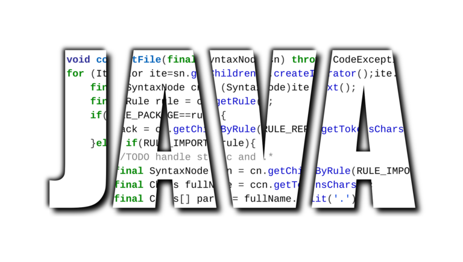

# Sentences

## Descripción

Esta aplicación consiste en un pequeño backend montado con Java que nos permite inyectar frases en una base de datos PostgreSQL y también visualizar todas las frases existentes.

## Consideraciones

### Añadir dependencias manualmente

En este proyecto, vamos a trabajar con una base de datos postgres.
Para interactuar con esta base de datos, deberemos descargar el driver para Java. En este caso, se trata de un archivo llamado postgresql-42.6.0.jar.
En mi caso, voy a guardar el archivo en la raíz de mi proyecto tras lo cual, lo añadiré en IntelliJ como dependencia.

Para añadir dependencias manualmente en IntelliJ IDEA, nos dirigiremos a File / Project Structure (a donde también podemos acceder directamente mediante la combianción de teclas Ctrl+Alt+Shift+S).
Una vez allí, entraremos en Modules / dependencies, desde donde pulsaremos la combinación de teclas Alt+Insert para seleccionar el tipo de dependencia (en este caso, será un jar) y navegar hasta donde se encuentre esta para poder importarla.
Una vez importada, la seleccionamos, pulsamos apply y ok para dejar lista nuestra nueva dependencia.
